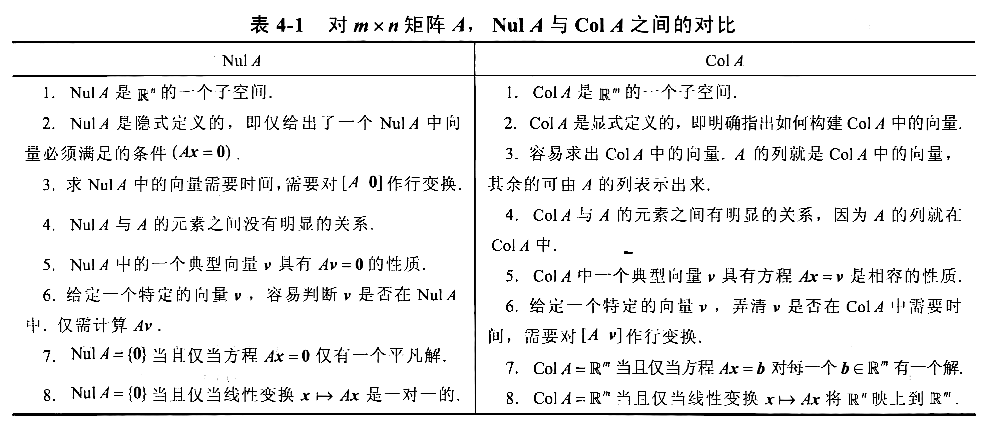

写在前面：

- 本文档旨在对线性代数中的基本内容进行总结，列出重要的概念、定义及定理，但通常忽略定理的证明过程.
- 本文档主要引用自《线性代数及其应用》（戴维·C.雷等著，机械工业出版社，原书第5版），但其中还穿插了编者个人的理解.
- 本文档的内容会不定期更新.

# 第一章	线性代数中的线性方程组

## 1.1	线性方程组

- 线性方程组的定义、解、解集，两个线性方程组的等价性
- 线性方程组的解有三种情况：无解、有唯一解、有无穷多解
- 线性方程组的相容性与不相容性
- 线性方程组的**系数矩阵**与**增广矩阵**
- **初等行变换**
  - 倍加变换
  - 对换变换
  - 倍乘变换
- 两个矩阵称为**行等价**的，若其中一个矩阵可以经一系列初等行变换成为另一个矩阵.
- 行变换是**可逆**的.
- 若两个线性方程组的增广矩阵是行等价的，则它们具有相同的解集.

## 1.2	行化简与阶梯形矩阵

本节正式提出高斯消去法，它可用来解任意线性方程组.同时该算法也可以回答解的存在性问题.

- 阶梯形矩阵的定义
  - 每一非零行都在每一零行之上
  - 某一行的先导元素（最左非零元素）所在的列位于前一行先导元素的右边
  - 某一先导元素所在列下方都是零
- 简化（行）阶梯形矩阵，除了满足上述三点，还满足
  - 每一非零行的先导元素是 1
  - 每一先导元素 1 是该元素所在列的唯一非零元素
- 任何非零矩阵都可以行化简变为阶梯形矩阵.
- **定理 1.1**（简化阶梯形矩阵的唯一性）：每个矩阵行等价于**唯一**的简化阶梯形矩阵.
- 行化简算法
  - 第一步，由最左的非零列开始，这是一个主元列
  - 第二步，在主元列中选取一个非零元素作为主元
  - 第三步，倍加变换，使主元下方的元素变为 0
  - 第四步，对剩下的子矩阵使用上述三步，直到没有非零行
  - 第五步，由最右边的主元开始，把每个主元上方的各元素变为 0.若某个主元不是 1，用倍乘变换把它变成 1.
- **基本变量/先导变量**是线性方程组增广矩阵等价的简化阶梯形的主元列对应的变量，其它变量称为**自由变量**.
- **定理 1.2**（存在与唯一性定理）
  - 线性方程组相容的充分必要条件是增广矩阵的最右列不是主元列.
  - 若线性方程组相容，则它的解可能有两种情形
    - 当没有自由变量时，有唯一解.
    - 若至少有一个自由变量，则有无穷多解.此时基本变量可用一个或多个自由变量表示，由此得到通解.

## 1.3	向量方程

线性代数的一个主要思想是研究可以表示为某一固定向量集合 $\{v_1,v_2,\cdots,v_p\}$ 的线性组合的所有向量. $\{v_1,v_2,\cdots,v_p\}$ 的所有线性组合所成的集合用记号 $Span\{v_1,v_2,\cdots,v_p\}$ 表示，称为由 $\{v_1,v_2,\cdots,v_p\}$ 所**生成/张成的 $\mathbb{R}^n$ 的子集**.要判断某个向量是否属于这一子集，实际上就是判断一个向量方程是否有解.

## 1.4	矩阵方程 $Ax=b$

线性代数中的一个基本思想是把向量的线性组合看作矩阵（由向量构成）与向量（由系数构成）的积.

- 矩阵方程与对应的向量方程有相同的解集，又与增广矩阵的线性方程组有相同的解集.
- 矩阵方程 $Ax=b$ 有解当且仅当 $b$ 是 $A$ 的各列的线性组合.
- **定理 1.4**：设 $A$ 是 $m \times n$ 矩阵，下列命题等价
  - 对 $\mathbb{R}^m$ 中的**每一个** $b$ ，方程 $Ax=b$ 有解
  - $\mathbb{R}^m$ 中的每个 $b$ 都是 $A$ 的列的一个线性组合
  - $A$ 的各列生成 $\mathbb{R}^m$
  - $A$ 在每一行都有一个主元位置

## 1.5	线性方程组的解集

- 一个线性方程组称为**齐次**的，若它可写成 $Ax=0$ 的形式.
- 齐次线性方程组至少有一个解，即全零解，它称为平凡解.
- 齐次线性方程组有非平凡解，当且仅当方程组至少有一个自由变量. 因为如果它只有唯一解，那么唯一解一定是零解. 一旦它有其它解，那么它有无穷多解，此时至少有一个自由变量.
- 齐次线性方程组总可以表示为若干个解向量的生成子集.若唯一解是零向量，则只有平凡解.若方程组只有一个自由变量，那么解集是通过原点的一条直线.
- **定理 1.6**：设方程组 $Ax=b$ 对某个 $b$ 是相容的，$p$ 为一个特解，则 $Ax=b$ 的解集是所有形如 $w=p+v_h$ 的向量的集，其中 $v_h$ 是齐次方程 $Ax=0$ 的任意一个解.该定理说明，若 $Ax=b$ 有解，则解集可由 $Ax=0$ 的解集平移向量 $p$ 得到，其中 $p$ 是 $Ax=b$ 的任意一个特解.

## 1.7	线性无关

引入线性相关概念的动机：考察齐次线性方程组的平凡解是否是唯一解.

- $$
  \mathbb{R}^n \ 中一组向量 \{v_1,\cdots,v_p\} 称为线性无关的，若向量方程  \ x_1v_1+\cdots+x_pv_p=\mathbf{0} \ 仅有平凡解. \\ 这组向量称为线性相关的，若存在不全为零的系数，使 \sum c_iv_i = \mathbf{0}
  $$

- 矩阵 $A$ 的各列线性无关，当且仅当方程 $Ax=0$ 仅有平凡解.

- 只含一个向量的集合线性无关当且仅当该向量不是零向量.单个零向量是线性相关的.

- 两个向量的集合线性相关，当且仅当其中一个向量是另一个向量的倍数.

- **定理 1.7**（线性相关集的特征）：两个或多个向量的集合线性相关，当且仅当其中**至少有一个**向量是其他向量的线性组合.

- 事实上，若向量组 $S$ 线性相关，且 $v_1 \neq 0$，则某个 $v_j$ 是它前面向量的线性组合.

- **定理 1.8**：若一个向量组的个数超过每个向量的维度，那么这个向量组线性相关.

- **定理 1.9**：若向量组 $S$ 包含零向量，则它线性相关.

- 线性相关的集合意义：如果某个向量在其它向量生成的空间上，则该组向量线性相关.

## 1.8	线性变换介绍

矩阵作用于一个向量，将其变换为另一个向量.每个矩阵变换都是线性变换.

- 矩阵 $A$ 是 $m \times n$ 的矩阵，它把 $\mathbb{R}^n$ 中的每个向量 $x$ 映射到 $\mathbb{R}^m$ 中的一个向量 $T(x)$. 
- 集 $\mathbb{R}^n$ 称为 $T$ 的定义域，集 $\mathbb{R}^m$ 称为 $T$ 的余定义域（或取值空间）.
- 用矩阵变换描述存在性与唯一性问题：唯一性问题，即 $b$ 是否是唯一的像？存在性问题，即是否存在 $x$ 使它的像为 $c$ ？
- 几类具有明确集合意义的矩阵变换
  - 投影变换：方阵，只有主对角线上分布元素 1
  - 剪切变换：方阵，它将线段映射成为线段，将顶点映射成为顶点，而底不变
  - 旋转变换
- 线性变换的定义：（1）$T(u+v)=T(u)+T(v)$  （2）$T(c \mathbf{u})=c\ T(\mathbf{u})$，即线性变换保持向量的加法运算与标量乘法运算.
- 线性变换将零向量映射到零向量.

## 1.9	线性变换的矩阵

**从 $\mathbb{R}^n$ 到 $\mathbb{R}^m$ 的每一个线性变换实际上都是一个矩阵变换 $x\mapsto Ax$，而且变换 $T$ 的重要性质都归结为 $A$ 的性质.**

**寻找矩阵 $A$ 的关键是知道下列事实： $T$ 完全由它对 $n \times n $ 单位矩阵的各列的作用所决定.** 这句话的本质是，知道了线性变换对基向量的作用效果，就知道了对所有向量的作用效果.只要知道了 $x$ 和基向量的线性关系，以及经过 $T$ 作用后的基向量的坐标，就能直接写出 $x$ 经 $T$ 变换后的坐标，因此就能直接写出这一线性变换所对应的矩阵 $A$. 这一性质可总结为下列定理：

**定理 1.10**：设 $T:\mathbb{R}^n \mapsto \mathbb{R}^m$ 为线性变换，则存在唯一的 $m \times n$ 矩阵 $A$，使得对 $\mathbb{R}^n$ 中的一切 $x$，有 $T(x) = Ax$ .

且有：$A = [T(e_1) \ \cdots \ T(e_n)]$，其中 $e_j$ 是 $\mathbb{R}^n$ 中单位矩阵的第 $j$ 列.

这一矩阵 $A$ 称为**线性变换 $T$ 的标准矩阵**.

之所以称之为标准矩阵，是因为其将单位正交基作为定义域的基向量，此时，$x$ 的坐标即是其与正交基之间的线性关系. 将 $A$ 作用于 $x$，就相当于将经过线性变换之后的 $T(e_i)$ 作用于 $x$ 相对于正交基的各分量.

**定理 1.11**：线性变换是一一对应的，当且仅当 $Ax=0$ 仅有平凡解. 这是因为，欲使 $Ax=b$ 有唯一解，$Ax=b$ 不能有自由变量，此时 $Ax=0$ 仅有平凡解.

**定理 1.12**：

（1）$T$ 把 $\mathbb{R}^n$ 映射到 $\mathbb{R}^m$，当且仅当 $A$ 的列生成 $\mathbb{R}^m$ ；这是因为，它等价于 $Ax=b$ 对每个 $b$ 都相容，由定理 1.4 得证.

（2）$T$ 是一对一的，当且仅当 $A$ 的列线性无关. 由定理 1.11 和 1.7 节得证.

# 第二章	矩阵代数

学会矩阵的代数运算后，我们分析和解方程的能力将会大大提高.

## 2.1	矩阵运算

- 一般情况下，$AB \neq BA$.
- 若 $AB = AC$，一般情况下，$B=C$ 并不成立.
- 若 $AB = \mathbf{0}$，一般情况下，不能断定 $A=\mathbf{0}$ 或 $B=\mathbf{0}$.
- $A^0$ 被解释为单位矩阵
- 矩阵的转置的性质
  - $(A^T)^T=A$
  - $(A+B)^T=A^T+B^T$
  - $(rA)^T=rA^T$
  - $(AB)^T=B^TA^T$

## 2.2	矩阵的逆

需要指出的是，仅对方阵研究矩阵的逆. 这是为什么呢？

对于任意矩阵 $A$，如果存在矩阵 $C$ 和 $D$，使得 $CA=I$ 且 $AD=I$，那么可以证明，$A$ 必是方阵，且 $C=D$.

- 一个 $n \times n$ 方阵 $A$ 是可逆的，若存在一个 $n \times n$ 矩阵 $C$ 使 $AC=CA=I$.
- 若 $A$ 可逆，那么它的逆是唯一的，记为 $A^{-1}$，于是 $A^{-1}A=I $ 且 $AA^{-1}=I$.
- 不可逆矩阵称为奇异矩阵. 可逆矩阵称为非奇异矩阵.
- 逆矩阵可用于解线性方程组. **定理 2.5**：若 $A$ 是可逆矩阵，则方程 $Ax=b$ 有唯一解 $x=A^{-1}b$.
- 逆矩阵的性质
  - 若 $A$ 可逆，则 $A^{-1}$ 也可逆且 $(A^{-1})^{-1}=A$.
  - 若 $A$ 和 $B$ 都是可逆矩阵且维数相同，则 $AB$ 也可逆，且 $(AB)^{-1}=B^{-1}A^{-1}$.
  - 若 $A$ 可逆，则 $A^T$ 也可逆，且 $(A^T)^{-1}=(A^{-1})^T$.
- 初等矩阵
  - 把单位矩阵进行一次初等行变换，就得到初等矩阵.
  - 初等矩阵有三类，分别对应三种初等行变换：倍加矩阵（单位矩阵+一个数）、交换矩阵（交换单位矩阵）、倍乘矩阵（主对角线某元素倍乘）.
  - 若对矩阵 $A$ 进行某种初等行变换，相当于将对应的初等矩阵 $E$ 作用于（左乘）矩阵 $A$，其中 $E$ 是由单位矩阵进行相同的行变换所得.
  - 行变换是可逆的，因此初等矩阵也是可逆的. 对于初等矩阵 $E$ ，有*同一类型*的另一行变换把 $E$ 变回 $I$，因此有同一类型的初等矩阵 $F$，使得 $FE=I$. 同时，由于二者对应于互逆的变换，因此也有 $EF=I$.
- **定理 2.7**：$n \times n$ 矩阵 $A$ 是可逆的，当且仅当 $A$ 行等价于单位矩阵 $I_n$，这时，把 $A$ 化简为单位矩阵的一系列初等行变换同时把单位矩阵变为 $A^{-1}$. 也即，如果 $E_pE_{p-1}\cdots E_1A=I_n$，那么 $A^{-1}=E_pE_{p-1}\cdots E_1$.
- 由定理 2.7 可以得到一个求逆矩阵的算法：既然将 $A$ 和单位矩阵施以同样的行变换，在 $A$ 变为单位矩阵的同时，单位矩阵变为 $A^{-1}$，那么可以将 $A$ 和单位矩阵并列，同时进行行变换. 即对增广矩阵 $[A \ \ I]$ 进行化简，若 $A$ 行等价于 $I$，即能够化简为单位矩阵，那么 $[A \ \ I]$ 行等价于 $[I \ \ A^{-1}]$.

## 2.3	可逆矩阵的特征

本节对上文的各知识点融会贯通，总结为以下定理：

**定理 2.8（可逆矩阵定理）**：设 $A$ 为 $n \times n$ 矩阵，则下列命题等价

- $A$ 是可逆矩阵
- $A$ 行等价于 $n \times n$ 单位矩阵
  - 由定理 2.7 可得
- $A$ 有 $n$ 个主元位置
  - 说明 $A$ 行等价于单位矩阵
- 方程 $Ax=\mathbf{0}$ 仅有平凡解
  - 此时方程组没有自由变量，说明 $A$ 满秩
- $A$ 的各列线性无关
  - 与 $A$ 满秩等价
- 线性变换 $x \mapsto Ax$ 是一对一的
  - 与 $A$ 满秩等价
- 对 $\mathbb{R}^n$ 中的任意 $b$，方程 $Ax=b$ 至少有一个解
  - 由定理 1.4 可得
- $A$ 的各列生成 $\mathbb{R}^n$
  - 由定理 1.4 可得
- 线性变换 $x \mapsto Ax$ 把 $\mathbb{R}^n$ 映上到 $\mathbb{R}^n$
  - 由定理 1.4 可得
- 存在 $n \times n$ 矩阵 $C$，使 $CA=I$
- 存在 $n \times n$ 矩阵 $D$，使 $AD=I$
- $A^T$ 是可逆矩阵
  - 由逆矩阵的性质可得
- $A$ 的列向量构成 $\mathbb{R}^n$ 的一个基
- Col $A$ = $\mathbb{R}^n$
- dim Col $A$ = $n$
- rank $A$ = $n$
- Nul $A$ = {$\mathbf{0}$}
- dim Nul $A$ = 0
- $A$ 的行列式不等于 0
- 0 不是 $A$ 的特征值
  - 若 0 是 $A$ 的特征值，那么 $Ax=0$ 有非平凡解，说明 $A$ 不可逆

由上述定理可得出：若 $A$ 和 $B$ 都为方阵，且 $AB=I$，则 $A$ 和 $B$ 都是可逆的，$B=A^{-1}$，$A=B^{-1}$.

既然已经讨论了可逆矩阵，那么自然而然就要讨论可逆线性变换. 一个线性变换 $T$ 是可逆的，如果存在从 $\mathbb{R}^n$ 到 $\mathbb{R}^n$ 的函数 $S$，使得对任意 $x$，都有 $S(T(x))=T(S(x))=x$. 下面的定理指出，如果存在这样的 S，那么它是唯一的，而且它必是线性变换.

**定理 2.9**：设 $T:\mathbb{R}^n \rightarrow \mathbb{R}^n$ 为线性变换，$A$ 为 $T$ 的标准矩阵，则 $T$ 可逆当且仅当 $A$ 可逆，这时由 $S(x)=A^{-1}x$ 定义的线性变换函数 $S$ 是满足定义的唯一函数.

由此可知，如果线性变换 $T:\mathbb{R}^n \rightarrow \mathbb{R}^n$ 是一对一的，那么 $A$ 的各列是线性无关的，因此 $A$ 可逆，故 $T$ 可逆.

## 2.5	矩阵因式分解

矩阵 $A$ 的因式分解是把 $A$ 表示为两个或更多个矩阵的乘积.

## 2.8	$\mathbb{R}^n$ 的子空间

设置 2.8 节和 2.9 节是为了使初学者能更好地进入第 4 章.

子空间对加法和标量乘法封闭. $\mathbb{R}^n$ 中的一个子空间是 $\mathbb{R}^n$ 中的集合 $H$，它具有以下三个性质：

- $\mathbf{0} \in H$
- $\forall u,v \ \ \  u+v \in H$
- $\forall u$ 和数 $c$，$c\mathbf{u} \in H$

有两个平凡的子空间：$\mathbb{R}^n$自身、零子空间.

矩阵 $A$ 的列空间是 $A$ 的各列的线性组合的集合，记作 $Col A$，它和 $Span\{a_i...\}$ 相同. 需要注意的是，$Col A$ 是 $\mathbb{R}^m$ 的子空间，但仅当 $A$ 的列生成 $\mathbb{R}^m$ 时，才有 $Col A$ 等于 $\mathbb{R}^m$.

当线性方程组写成 $Ax=b$ 的形式时，$A$ 的列空间是使方程组有解的向量 $b$ 的集合. 这可以理解为：$x$ 是 $A$ 的各列向量的系数，$b$ 是$A$ 的各列向量乘以系数的线性组合，自然也在该空间中.

矩阵 $A$ 的零空间是齐次方程 $Ax=0$ 的所有解的集合，记为 Nul $A$.

**定理 2.12：**$m \times n$ 矩阵 $A$ 的零空间是 $\mathbb{R}^n$ 的子空间.

$\mathbb{R}^n$ 中子空间 $H$ 的一组基是 $H$ 中一个线性无关集，它生成 $H$.

求出方程 $Ax=0$ 的解集的参数向量形式实际上就是确定 Nul $A$ 的基. 这一点在后文还会提到.

**定理 2.13**：矩阵 $A$ 的主元列构成 $A$ 的列空间的基. 需要指出的是，主元列是指原始矩阵 $A$ 的数，而非它的阶梯形的数.

## 2.9	维数与秩

- 坐标向量的概念：已经得到子空间 $H$ 的一组基 $\mathcal{B}=\{b_1,b_2,\cdots ,b_p\}$，向量 $x$ 相对于 $\mathcal{B}$ 的坐标就是反映线性组合关系的权系数.
- 非零子空间 $H$ 的**维数**（记为 dim $H$）是 $H$ 的任意一个基的向量个数. 零子空间的维数定义为 0.
- 矩阵 $A$ 的**秩**（记为 rank $A$）是 $A$ 的列空间的维数. 它也等于 $A$ 的主元列的个数.
- **定理 2.14（秩定理）**：如果一个矩阵 $A$ 有 $n$ 列，那么有：rank $A$ + dim Nul $A$ = $n$ . 此定理在后文还会详细解释.
- **定理 2.15（基定理）**：设 $H$ 是 $\mathbb{R}^n$ 的 $p$ 维子空间，$H$ 中的任何恰好由 $p$ 个元素组成的线性无关集构成 $H$ 的一个基. 并且，$H$ 中任何生成 $H$ 的 $p$ 个向量集也构成 $H$ 的一个基.

# 第三章	行列式

为什么要引入行列式？本章首先指出，通过计算行列式的值可以判断矩阵是否可逆.

## 3.1	行列式介绍

- 行列式的递归定义：令 $A_{ij}$ 表示矩阵 $A$ 删去第 $i$ 行和第 $j$ 列后得到的子矩阵，则 det $A$ = $\sum_{j=1}^n(-1)^{1+j}$ det $A_{1j}$
- 若进一步定义**余因子**：$C_{ij}=(-1)^{i+j}$ det $A_{ij}$，则有**定理 3.1**：方阵 $A$ 可以按任意行或任意列展开： det $A$ = $\sum_{k=1}^na_{ik}C_{ik}=\sum_{k=1}^na_{kj}C_{kj}$，上式分别给出了按第 $i$ 行展开和按第 $j$ 列展开的方式. 此定理在计算含许多 0 的行列式时很有用.
- 三角阵的行列式等于主对角线上元素的乘积.

## 3.2	行列式的性质

- 初等行变换对行列式的值的影响
  - 倍加变换：行列式的值**不变**
  - 对换变换：行列式的值变为原来的相反数
  - 倍乘变换：倍乘 $k$，行列式的值变为原来的 $k$ 倍，此性质可用于提取某一行的公因子
- **定理 3.4**：方阵 $A$ 是可逆的当且仅当 det $A \neq 0$，根据此定理可得出：若 $A$ 的各列/各行线性相关，则其行列式为 0. 特别地，若其某两行或某两列相等，则它的行列式为 0.
- **定理 3.5**：$|A|=|A^T|$，这说明行列式的列变换与行变换具有相同的效果.
- **定理 3.6**：$|AB|=|A||B|$. 注意，此定理只对乘法适用，对加法不适用.

## 3.3	克拉默法则

首先指出，克拉默法则对于手工计算没有太大的帮助，它更多地被用于理论计算中.

**定理 3.7**：设 $A$ 是 $n$ 阶可逆方阵，则方程 $Ax=b$ 的唯一解可由下式给出：$x_i=|A_i(b)|\ / \ |A|$，其中 $A_i(b)$ 表示 $A$ 中第 $i$ 列向量由 $b$ 替换得到的矩阵.

**定理 3.8**：设 $A$ 是可逆矩阵，则有 $A^{-1}=\frac{adj \ A}{|A|}$. 其中，伴随矩阵 adj $A$ 是矩阵 $A$ 的*余因子矩阵*的转置. 需要指出的是，此式通常为理论工具，实际上很少使用此式计算逆矩阵.

**定理 3.10**：对于由二阶或三阶方阵确定的线性变换，矩阵的行列式的值表明了有限封闭区域内面积（二阶）或体积（三阶）经过线性变换之后改变的比值.

# 第四章	向量空间

*在第 1 章和第 2 章中种植的数学种子将在这一章中生长并且开始开花.    ——《线性代数及其应用》*

## 4.1	向量空间与子空间

一个**向量空间**是由一些被称为向量的对象构成的非空集合 $V$，在这个集合上定义了两个运算，称为加法和标量乘法，服从以下公理，这些公理必须对 $V$ 中所有向量及所有标量均成立.

- 加法满足封闭性
- 标量乘法满足封闭性
- 向量的加法满足交换律
- 向量的加法满足结合律
- 存在一个零向量，使得 $u+0=u$
- 对于任意向量 $u$，存在一个向量 $-u$，使得 $u+(-u)=0$
- $c(u+v)=cu+cv$
- $(c+d)u=cu+du$
- $c(du)=(cd)u$
- $1u=u$

可以证明，上述公理中的零向量和负向量存在且唯一.

向量空间 $V$ 的一个子空间是 $V$ 的一个满足下列三条性质的子集 $H$：存在零向量、对加法封闭、对标量乘法封闭.

容易引起误会的是，$\mathbb{R}^2$ 不是 $\mathbb{R}^3$ 的子空间，前者甚至不是后者的子集，但若将 $\mathbb{R}^3$ 中某一维的坐标改为 0，则它是 $\mathbb{R}^3$ 的子空间.

**定理 4.1**：若下列 $v_i$ 均在向量空间 $V$ 中，则 Span$\{v_1,\cdots,v_p\}$ 是 $V$ 的一个子空间.

## 4.2	零空间、列空间和线性变换

在线性代数的应用中，$\mathbb{R}^n$ 的子空间通常由以下两种方式产生：（1）作为齐次线性方程组的解集；（2）作为某些确定向量的线性组合的集合. 

零空间的引入与齐次线性方程组有关. 事实上，它就是方程组的解空间.

定义矩阵 $A$ 的**零空间** Nul $A$ = $\{x:x \in \mathbb{R}^n,Ax=\mathbf{0}\}$.  Nul $A$ 是 $\mathbb{R}^n$ 中通过线性变换 $x \mapsto Ax$ 映射到 $\mathbb{R}^m$ 中的零向量的全体向量 $x$ 的集合.

**定理 4.2**：$m \times n$ 矩阵 $A$ 的零空间是 $\mathbb{R}^n$ 的一个子空间.

如何得到 $m \times n$ 矩阵的零空间的基？首先，得到矩阵的简化阶梯形矩阵，将非主元列作为自由变量，一共得到 $n - rank\ A$ 个自由变量. 然后，用自由变量表示基本变量，得到若干个系数向量，它的个数等于自由变量的个数. 这些系数向量就是零空间的基.

如何得到 $m \times n$ 矩阵的列空间的基？见定理 2.13.

定义矩阵 $A$ 的**列空间** Col $A$ = Span$\{a_1,\cdots,a_n\}$，它是 $\mathbb{R}^m$ 的一个子空间. 注意到，Col $A$ 中的每一个向量都是 $A$ 的列向量的线性组合，设该线性组合的系数向量为 $x$，那么 Col $A$ 中的向量即为 $Ax$. 于是有 Col $A={b:b=Ax,x\in \mathbb{R}^n}$. 这意味着列空间就是线性变换的值域.

至此，有必要将 Nul $A$ 和 Col $A$ 进行对比，尤其是它们的维数：

- 零空间需要使 $Ax$ 有效，因此零空间的维数是矩阵的列数 $n$
- 列空间是由矩阵的列向量生成的，它的维数就是列向量的维数，即矩阵的行数 $m$
- Nul $A$ 的维数是方程 $Ax=0$ 中自由变量的个数
- Col $A$ 的维数是 $A$ 中主元列的个数

判断一个向量 $u$ 是否属于某个矩阵的零空间或列空间：

- 若 $Au=0$，则 $u$ 属于 $A$ 的零空间，这可以直接通过计算判断
- 若 $Ax=u$ 是相容的，则 $u$ 属于 $A$ 的列空间，这可以通过将 $[A \quad u]$ 化简为阶梯形判断

下图展示了二者的详细对比信息.

线性变换的**核**是所有满足 $T(u)=0$ 的向量 $u$ 的集合. 线性变换的**值域**是所有具有形式 $T(x)$ 的向量的集合.

如果线性变换是由一个矩阵变换得到的，则它的核就是该矩阵的零空间，它的值域就是该矩阵的列空间.

## 4.3	线性无关集和基

令 $H$ 是向量空间 $V$ 的一个子空间，$V$ 中的向量集 $\mathcal{B}=\{b_1,\cdots,b_p\}$ 称为 $H$ 的一个**基**，如果

- $\mathcal{B}$ 是一组线性无关集
- $H=Span\{b_1,\cdots,b_p\}$

**定理 4.5（生成集定理）**：令 $S$ 是 $V$ 中的向量集，$H=Span\{S\}$

- 若 $S$ 中的某一向量是 $S$ 中其余向量的线性组合，则 $S$ 中去掉该向量后形成的集合仍然可以生成 $H$
- 若 $H \neq \{\mathbf{0}\}$，则 $S$ 的某一子集是 $H$ 的一个基 

## 4.5	向量空间的维数

**定理 4.9**：若向量空间 $V$ 具有一组基 $\mathcal{B}$，则 $V$ 中任意包含多于 $n$ 个向量的集合一定线性相关.

**定理 4.10**：若向量空间 $V$ 有一组基含有 $n$ 个向量，则 $V$ 的每一组基一定恰好含有 $n$ 个向量.

如果已有一组基有 $n$ 个向量，那么由定理 4.9 可以推出，多于 $n$ 个向量的集合一定不是基. 又假设存在某组基有少于 $n$ 个向量，那么由定理 4.9 可以得出不存在含有 $n$ 个向量的基，与事实矛盾，由此得出定理 4.10.

若 $V$ 由一个有限集生成，则 $V$ 称为有限维的，$V$ 的**维数**写成 dim $V$，是 $V$ 中基向量的个数. 零向量空间的维数定义为 0. 如果 $V$ 不是由一组有限集生成，则 $V$ 称为无穷维的.

**定理 4.11**：$H$ 是有限维向量空间 $V$ 的子空间，$H$ 中任意一个线性无关集均可以扩充成为 $H$ 的一个基，且有 dim $H \leqslant$ dim $V$.

**定理 4.12（基定理）**：令 $V$ 是一个 $p$ 维向量空间，$p \geqslant 1$，$V$ 中任意含有 $p$ 个元素的线性无关集必然是 $V$ 的一个基. 任意含有 $p$ 个元素且生成 $V$ 的集合自然也是 $V$ 的一个基.

## 4.6	秩

矩阵 $A$ 中线性无关列的最大个数和线性无关行的最大个数是一致的，它被称为矩阵的秩.

**定理 4.13**：若两个矩阵 $A$ 和 $B$ 行等价，则它们的行空间相同. 若 $B$ 是阶梯形矩阵，则 $B$ 的非零行构成 $A$ 的行空间的基、同时也构成 $B$ 的行空间的基.

定义：矩阵 $A$ 的秩即 $A$ 的列空间的维数.

**定理 4.14（秩定理）**：$m \times n$ 矩阵 $A$ 的列空间和行空间的维数相等，这个公共的维数是 $A$ 的秩，它还等于 $A$ 的主元列的个数，且满足方程 rank $A$ + dim Nul $A=n$，这个公式可以通俗地理解为：{主元列个数}+{非主元列个数}={列的个数}.

## 4.7	基的变换

**定理 4.15**：设 $\mathcal{B}=\{b_1,\cdots,b_n\}$ 和 $\mathcal{C}=\{c_1,\cdots,c_n\}$ 是向量空间 $V$ 的基，则存在一个 $n \times n$ 矩阵 $\mathop{\mathcal{P}}\limits_{\mathcal{C}\leftarrow \mathcal{B}}$ 使得
$$
[x]_{\mathcal{C}}=\mathop{\mathcal{P}}\limits_{\mathcal{C}\leftarrow \mathcal{B}}[x]_{\mathcal{B}}
$$

$\mathop{\mathcal{P}}\limits_{\mathcal{C}\leftarrow \mathcal{B}}$ 的列是基 $\mathcal{B}$ 中向量的 $\mathcal{C}$ - 坐标向量，即
$$
\mathop{\mathcal{P}}\limits_{\mathcal{C}\leftarrow \mathcal{B}} = [\ [b_1]_{\mathcal{C}}\quad [b_2]_{\mathcal{C}} \quad \cdots \quad [b_n]_{\mathcal{C}} \ ]
$$
该矩阵称为由 $\mathcal{B}$ 到 $\mathcal{C}$ 的坐标变换矩阵. 它的逆矩阵为反方向的坐标变换矩阵.

上述定理的通俗解释为：先把 $\mathcal{B}$ 变为 $\mathcal{C}$，变换的矩阵就是 $\mathcal{B}$ 在 $\mathcal{C}$ 下的坐标，再将该矩阵作用与 $x$ 相对于 $\mathcal{B}$ 的坐标，就得到了 $x$ 相对于 $C$ 的坐标.

对于 $\mathbb{R}^n$ 中的基变换，有两种情况：一是从标准基变换至非标准基；二是非标准基之间的变换.

从标准基变换到非标准基，坐标变换矩阵就是直接将非标准基作为列向量的矩阵.

两个非标准基之间互相转换，需要先求出一个基相对于另一个基的坐标，这实际上就是解线性方程组.

# 第五章	特征值与特征向量

在没有特别指出时，本章中的矩阵均为方阵.

## 5.1	特征向量与特征值

定义 $A$ 为 $n \times n$ 矩阵，$x$ 为非零向量，若存在数 $\lambda$ 使 $Ax=\lambda x$ 有非平凡解 $x$，则称 $\lambda$ 为 $A$ 的**特征值**，$x$ 称为对应于 $\lambda$ 的**特征向量**. 从上述定义可以看出，特征向量必须是非零的，但特征值可以为 0.

$\lambda$ 是 $A$ 的特征值当且仅当方程 $(A-\lambda I)x=\mathbf{0}$ 有非平凡解，它的解集是 $\mathbb{R}^n$ 的子空间，称为 $A$ 的对应于 $\lambda$ 的**特征空间**，它由零向量和所有对应于 $\lambda$ 的特征向量组成. $A$ 对特征空间中的所有向量均为拉伸（收缩）作用.

**定理 5.1**：三角矩阵的主对角线的元素是其特征值.

**定理 5.2**：$\lambda_1,\cdots,\lambda_r$ 是 $n \times n$ 矩阵 $A$ *相异*的特征值，$v_1,\cdots,v_r$ 是与 $\lambda_1,\cdots,\lambda_r$ 对应的特征向量，那么向量集合 $\{v_1,\cdots,v_r\}$ 线性无关. 通俗地讲，对应*不同*特征值的特征向量之间线性无关.

## 5.2	特征方程

数 $\lambda$ 是 $n \times n$ 矩阵 $A$ 的特征值的充分必要条件是 $\lambda$ 是**特征方程** det$(A-\lambda I)=0$ 的根. 这是因为，若方程 $(A-\lambda I)x=\mathbf{0}$ 有非平凡解，那么矩阵 $A-\lambda I$ 不可逆，行列式的值为 0.

可以看出，如果 $A$ 是 $n$ 阶方阵，那么 $|A-\lambda I|$ 是 $n$ 次多项式，称为 $A$ 的**特征多项式**.

把特征值 $\lambda$ 作为特征方程根的重数称为 $\lambda$ 的**代数重数**.

**相似矩阵**：假如 $A$ 和 $B$ 都是 $n$ 阶方阵，如果存在*可逆* 矩阵 $P$，使得 $P^{-1}AP=B$，则称 $A$ 相似于 $B$，同时也有 $B$ 相似于 $A$.

**定理 5.4**：若 $n$ 阶方阵 $A$ 和 $B$ 是相似的，那么它们有相同的特征多项式，从而有相同的特征值、相同的代数重数.

需要特别指出的是，即使两个同阶方阵的特征多项式完全相同（有相同的根和重数），这两个矩阵也不一定相似.

## 5.3	对角化

矩阵的对角化，能够帮助了解矩阵的特征值和特征向量的信息，且可快速计算矩阵的幂.

如果方阵 $A$ 相似于对角矩阵，即存在可逆矩阵 $P$ 和对角矩阵 $D$，使 $A=PDP^{-1}$，则称 $A$ **可对角化**.

**定理 5.5（对角化定理）**：$n$ 阶方阵 $A$ 可对角化的充分必要条件是 $A$ 有 $n$ 个线性无关的特征向量. 事实上，$A=PDP^{-1}$，$D$ 为对角矩阵的充分必要条件是 $P$ 的列向量是 $A$ 的 $n$ 个线性无关的特征向量. 此时，$D$ 的主对角线上的元素分别是 $A$ 的对应于 $P$ 中特征向量的特征值. 换句话说，$A$ 可对角化的充分必要条件是有足够的特征向量形成 $\mathbb{R}^n$ 的基，这样的基为**特征向量基**.

矩阵的对角化工作可分为 4 步来完成：

- 求出 $A$ 的特征值：通过计算特征多项式的根得到.
- 求出 $A$ 的特征向量：对于每一个特征值，分别计算对应特征空间的基.
- 构造 $P$：用上一步得到的向量构造矩阵 $P$.
- 用对应的特征值构造矩阵 $D$：构造时，特征值的次序必须和上一步选择的特征向量对应.

**定理 5.6**：有 $n$ 个相异特征值的 $n \times n$ 矩阵可对角化.

需要指出的是，即使没有 $n$ 个相异特征值，矩阵仍有可能是可对角化的，这就要求特征空间的维数等于对应特征值的代数重数.

**定理 5.7**：设 $A$ 是 $n$ 阶方阵，其相异的特征值是 $\lambda_1,\cdots,\lambda_p$

- 对于 $1 \leqslant k \leqslant p$，$\lambda_k$ 的特征空间的维数（称为 $\lambda_k$ 的**几何重数**）小于或等于 $\lambda_k$ 的代数重数.
- 矩阵 $A$ 可对角化的充分必要条件是所有不同特征空间的维数之和为 $n$，即（1）特征多项式可完全分解为线性因子，（2）每个 $\lambda_k$ 的几何重数等于代数重数.
- 若 $A$ 可对角化，$\mathcal{B}_k$ 是对应于 $\lambda_k$ 的特征空间的基，则集合 $\mathcal{B}_1,\cdots,\mathcal{B}_p$ 中所有向量的集合是 $\mathbb{R}^n$ 的特征向量基.

## 5.4	特征向量与线性变换

**定理 5.8**：设 $A=PDP^{-1}$，其中 $D$ 为 $n$ 阶对角方阵，若 $\mathbb{R}^n$ 的基 $\mathcal{B}$ 由 $P$ 的列向量组成，那么 $D$ 是线性变换 $x \mapsto Ax$ 的 $\mathcal{B}$ - 矩阵.

# 第六章	正交性和最小二乘法

## 6.1	内积、长度和正交性

**定理 6.2**：两个向量 $u$ 和 $v$ 正交的充分必要条件是 $\Vert u+v \Vert^2=\Vert u \Vert^2+\Vert v \Vert^2$.

如果向量 $z$ 与 $\mathbb{R}^n$ 的子空间 $W$ 中的任意向量都正交，则称 $z$ 正交于 $W$. 与子空间 $W$ 正交的向量 $z$ 组成的全体集合称为 $W$ 的**正交补**，记作 $W^{\bot}$.

**定理 6.3**：设 $A$ 是 $m \times n$ 矩阵，那么 $(Row\ A)^{\bot}=Nul\ A$ 且 $(Col\ A)^{\bot}=Nul\ A^T$.

## 6.2	正交集

$\mathbb{R}^n$ 中的向量集合 $\{u_1,\cdots,u_p\}$ 称为**正交集**，如果集合中的任意两个不同向量都正交.

**定理 6.4**：如果 $S$ 是由 $\mathbb{R}^n$ 中非零向量构成的正交集，那么 $S$ 是线性无关集，因此构成 $S$ 所生成的子空间的一组基.

$\mathbb{R}^n$ 中子空间 $W$ 的一个**正交基**是 $W$ 的一个基，也是正交集. 正交基比其它基优越.

**定理 6.5**：假设 $\{u_1,\cdots,u_p\}$ 是 $\mathbb{R}^n$ 子空间 $W$ 的正交基，对 $W$ 中的每个向量 $y$，线性组合 $y=\sum c_iu_i$ 中的权可以由 $c_j=\frac{y \cdot u_j}{u_j \cdot u_j}$ 计算.

如果正交集/基是由单位向量构成的，那么它们称作单位正交集/基.

**定理 6.6**：一个 $m \times n$ 矩阵 $U$ 具有单位正交列向量的充分必要条件是 $U^TU=I$.

**定理 6.7**：假设 $U$ 是一个具有单位正交列的 $m \times n$ 矩阵，且 $x$ 和 $y$ 是 $\mathbb{R}^n$ 中的向量，那么

- $\Vert Ux \Vert=\Vert x \Vert$
- $(Ux)·(Uy)=x·y$
- $(Ux)·(Uy)=0$ 的充分必要条件是 $x·y=0$

一个**正交矩阵**就是一个可逆方阵 $U$，且满足 $U^{-1}=U^T$. 可以验证，任何具有单位正交列的方阵是正交矩阵，恰巧，这类矩阵同样具有单位正交行.

# 第七章	对称矩阵和二次型

## 7.1	对称矩阵的对角化

一个**对称矩阵**是一个满足 $A^T=A$ 的矩阵 $A$，因此对称矩阵必是方阵，它的主对角线的元素是任意的，但其他元素在主对角线的两边成对出现.

**定理 7.1**：如果 $A$ 是对称矩阵，那么不同特征空间的任意两个特征向量是正交的.

一个矩阵 $A$ 称为**可正交对角化**，如果存在一个正交矩阵 $P$ 和一个对角矩阵 $D$ 使得 $A=PDP^T=PDP^{-1}$. 可以发现，$A^T=(PDP^T)^T=P^{TT}D^TP^T=PDP^T=A$.

**定理 7.2**：一个 $n$ 阶方阵 $A$ 可正交对角化的充分必要条件是 $A$ 是对称矩阵.

**定理 7.3（对称矩阵的谱定理）**：一个对称的 $n$ 阶方阵 $A$ 具有下述性质

- $A$ 有 $n$ 个**实**特征值，包含重复的特征值
- 对每一个特征值 $\lambda$，其几何重数等于代数重数
- 特征空间相互正交，这种正交性是在特征向量对应于不同的特征值的意义下成立的
- $A$ 可正交对角化

## 7.4	奇异值分解

令$A$ 是 $m \times n$ 矩阵，那么 $A^TA$ 是对称矩阵且可以正交对角化.  $A$ 的**奇异值**是 $A^TA$ 的特征值的平方根，记为 $\sigma_i$.

**定理 7.10（奇异值分解）**：设 $A$ 是秩为 $r$ 的 $m \times n$ 矩阵，那么存在一个 $m \times n$ 的矩阵 $\Sigma$ ，其中 $D$ （即该矩阵的非零部分）的对角线元素是 $A$ 的前 $r$ 个奇异值，$\sigma_1 \geqslant \sigma_2 \geqslant \cdots \geqslant \sigma_r > 0$ ，并且存在一个 $m \times m$ 正交矩阵 $U$ 和一个 $n \times n$ 正交矩阵 $V$ 使得 $A=U\Sigma V^T$.  这样的一个分解中，$U$ 的列称为 $A$ 的左奇异向量，$V$ 的列称为 $A$ 的右奇异向量.

奇异值分解可分为三步进行

- 将矩阵 $A^TA$ 正交对角化
- 算出 $V$ 和 $\Sigma$：将 $A^TA$ 的特征值按降序排列，它们对应的单位特征向量 $v_i$ 就是 $A$ 的右奇异向量，它们的奇异值组成了 $\Sigma$
- 构造 $U$：让矩阵 $A$ 的秩为 $r$ 时，矩阵 $U$ 的前 $r$ 列是从 $Av_i$ 计算得到的单位向量. $U$ 的其它列是将该集合扩充至 $\mathbb{R}^m$ 的单位正交基而得到的.
